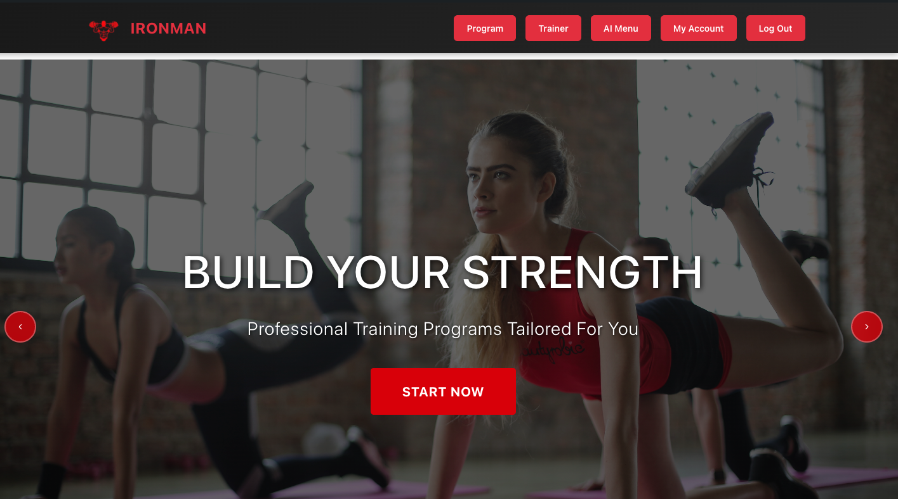
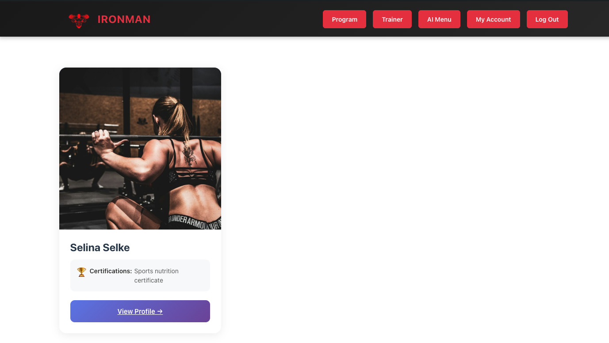
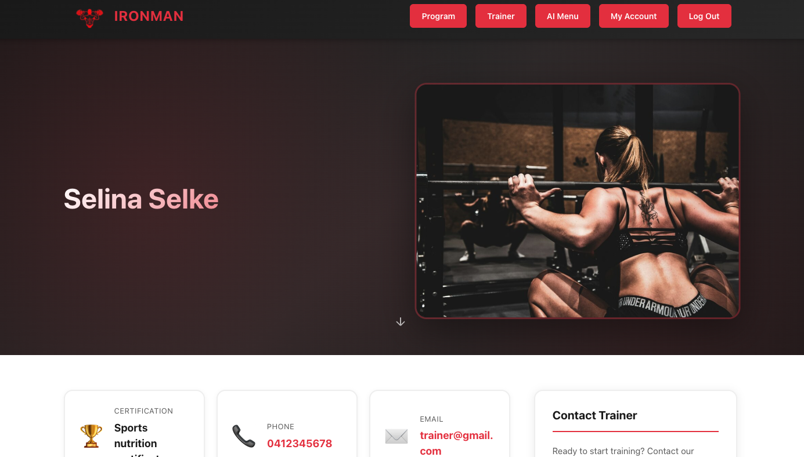
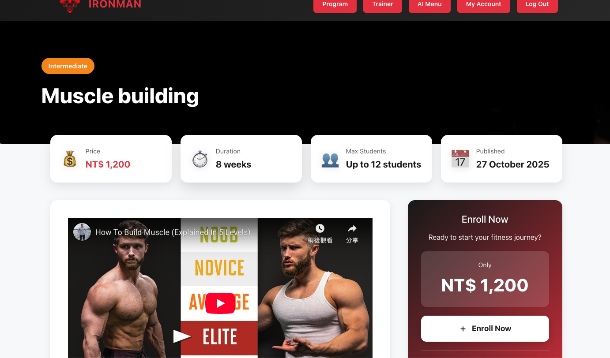
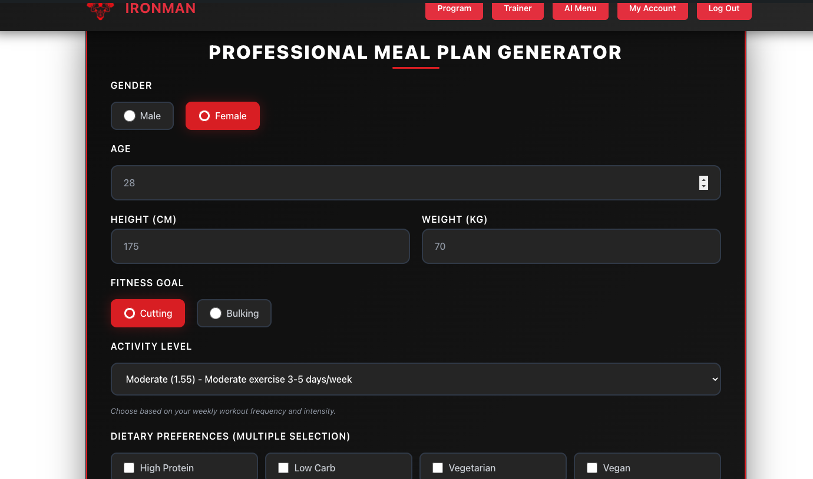
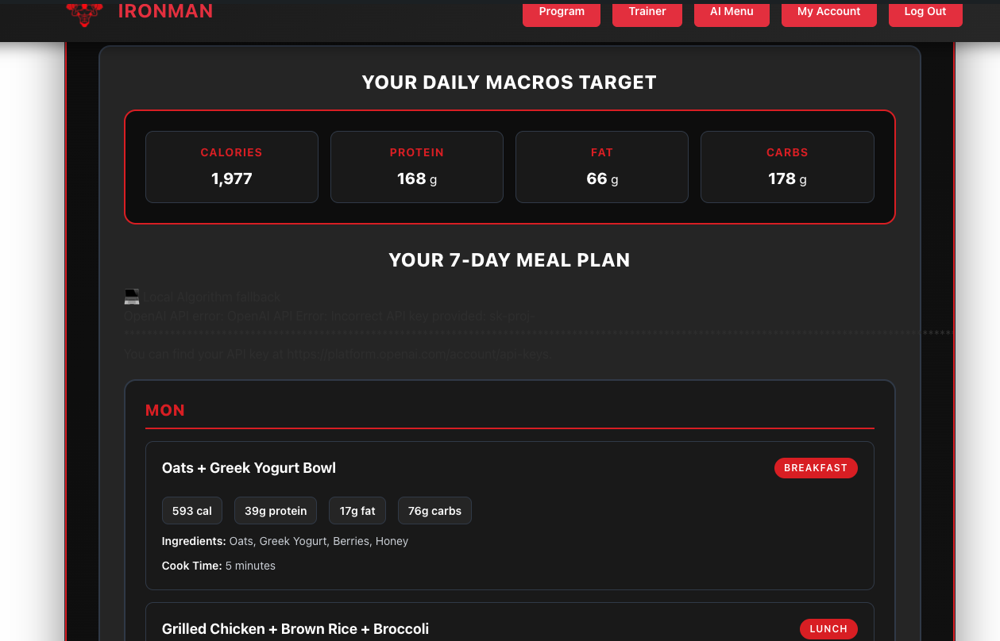
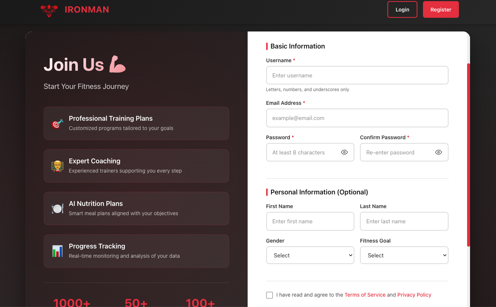

# IronMan Fitness 💪

A comprehensive WordPress-based fitness platform with custom training programs, trainer management, meal planning, and member registration features.

[](https://opensource.org/licenses/MIT)
[](https://wordpress.org/)
[](https://php.net/)

---

## 📑 Table of Contents

- [Demo](#-demo)
- [Features](#-features)
- [Installation](#-installation)
- [Usage](#-usage)
- [Tech Stack](#-tech-stack)
- [Screenshots](#-screenshots)
- [Contributing](#-contributing)
- [License](#-license)
- [Contact](#-contact)

---

## 🎯 Demo

🌐 **Live Demo:** [Visit IronMan Fitness](https://iron-man-fitness-production.up.railway.app/)

📱 **Mobile Friendly:** Optimized for all devices

---

## ✨ Features

### 🏋️ Training Programs

- Custom training program post type
- Program categories and filtering
- Detailed program information pages
- Visual program cards with images
- Shortcode support: `[program_list]`

### 👨‍🏫 Trainer Management

- Trainer profile system
- Custom trainer post type with meta fields
- Experience, certifications, and contact info
- Social media integration
- Photo upload functionality
- Shortcode support: `[trainer_list]`

### 🍽️ Meal Plan Generator

- AI-powered meal plan creation
- Customizable dietary preferences
- Calorie and macro tracking
- Standalone meal planning page

### 🎨 Custom Templates

- **Welcome Page**: Hero carousel with videos and features
- **Registration Page**: Custom member registration form
- **Single Trainer**: Detailed trainer profile pages
- **Single Program**: Comprehensive program detail pages
- **Custom Header**: Enhanced navigation with dropdown menus

### 📱 Responsive Design

- Mobile-first approach
- Touch-friendly interfaces
- Optimized for all screen sizes
- Modern CSS Grid and Flexbox layouts

### 🎭 User Experience

- Smooth animations and transitions
- Interactive carousels and sliders
- Progress tracking bars
- Social media sharing functionality
- Image lightbox effects

---

## 🚀 Installation

### ⚡ Quick Start Guide

Choose your preferred development environment:

| Method              | Best For                           | Setup Time |
| ------------------- | ---------------------------------- | ---------- |
| **MAMP + PHPStorm** | Local development, beginners       | 10-15 mins |
| **Docker**          | Advanced users, team collaboration | 5 mins     |
| **Production**      | Live deployment                    | 15-20 mins |

### Prerequisites

**For MAMP Setup:**

- MAMP (macOS/Windows)
- PHPStorm or any code editor
- Git

**For Docker Setup:**

- Docker Desktop
- Git

**For Production:**

- PHP 7.4 or higher
- WordPress 6.x
- MySQL 5.7+ or MariaDB 10.3+
- Apache or Nginx web server

### Step 1: Clone the Repository

```bash
git clone https://github.com/ChienHuang0818/wordpress-IronMan.git
cd wordpress-IronMan
```

---

## 💻 Local Development Setup (MAMP + PHPStorm)

### Step 2: Download and Install MAMP

1. **Download MAMP:**

   - Visit [https://www.mamp.info/](https://www.mamp.info/)
   - Download MAMP for your operating system (macOS/Windows)
   - Install MAMP following the installation wizard

2. **Configure MAMP:**
   - Launch MAMP application
   - Click "Start Servers" to start Apache and MySQL
   - Default ports: Apache (8888), MySQL (8889)
   - Access phpMyAdmin at `http://localhost:8888/phpMyAdmin/`

### Step 3: Setup WordPress in MAMP

1. **Clone Project into htdocs:**

   ```bash
   cd /Applications/MAMP/htdocs/
   git clone https://github.com/ChienHuang0818/wordpress-IronMan.git wordpress
   ```

   Or manually:

   - Extract the project files
   - Copy to `/Applications/MAMP/htdocs/wordpress/`

2. **Create Database:**

   - Open phpMyAdmin at `http://localhost:8888/phpMyAdmin/`
   - Username: `root`, Password: `root` (MAMP default)
   - Create a new database named `ironman_fitness`

3. **Configure wp-config.php:**

   Update database settings in `wp-config.php`:

   ```php
   define('DB_NAME', 'ironman_fitness');
   define('DB_USER', 'root');
   define('DB_PASSWORD', 'root');
   define('DB_HOST', 'localhost:8889');
   ```

4. **Access WordPress:**
   - Navigate to `http://localhost:8888/wordpress/`
   - Follow WordPress installation wizard
   - Set up admin account

### Step 4: Open Project in PHPStorm

1. **Launch PHPStorm:**

   - Open PHPStorm IDE
   - File → Open → Select `/Applications/MAMP/htdocs/wordpress/`

2. **Configure PHP Interpreter:**

   - PHPStorm → Preferences → PHP
   - Set CLI Interpreter to MAMP's PHP:
     - macOS: `/Applications/MAMP/bin/php/php7.4.x/bin/php`
     - Windows: `C:\MAMP\bin\php\php7.4.x\php.exe`

3. **Enable WordPress Support:**

   - PHPStorm → Preferences → PHP → Frameworks → WordPress
   - Check "Enable WordPress Support"
   - Set WordPress installation path

4. **Start Development:**
   - Edit theme files in `wp-content/themes/hello-elementor/`
   - Changes will be reflected immediately in the browser

### Step 5: Activate Theme and Configure

1. **Activate Theme:**

   - Go to WordPress Admin → Appearance → Themes
   - Activate "Hello Elementor" theme

2. **Set Permalinks:**

   - Go to Settings → Permalinks
   - Select "Post name" and save

3. **Import Sample Content (Optional):**
   - If you have a database dump, import it via phpMyAdmin
   - Or create sample content manually

---

## 🐳 Alternative: Docker Installation

If you prefer using Docker instead of MAMP:

### Step 1: Prerequisites

- Install [Docker Desktop](https://www.docker.com/products/docker-desktop)
- Ensure Docker is running

### Step 2: Build and Start Containers

```bash
cd wordpress-IronMan
docker-compose up -d
```

### Step 3: Access the Site

- WordPress: `http://localhost:8080`
- phpMyAdmin: `http://localhost:8081`

### Step 4: Stop Containers

```bash
docker-compose down
```

---

## 🔧 Troubleshooting

### Common MAMP Issues

**Problem: Can't access localhost:8888**

```bash
# Solution: Check if MAMP servers are running
# MAMP → Start Servers
# Verify Apache and MySQL lights are green
```

**Problem: Database connection error**

```php
# Solution: Verify wp-config.php settings
define('DB_HOST', 'localhost:8889'); // Note: Port 8889 for MAMP
```

**Problem: 404 errors on pages**

```bash
# Solution: Reset permalinks
# WordPress Admin → Settings → Permalinks → Save Changes
```

### Common WordPress Issues

**Problem: Theme not appearing**

```bash
# Solution: Check file permissions
chmod -R 755 wp-content/themes/hello-elementor/
```

**Problem: Can't upload images**

```bash
# Solution: Check uploads folder permissions
chmod -R 755 wp-content/uploads/
```

**Problem: White screen of death**

```bash
# Solution: Enable debug mode in wp-config.php
define('WP_DEBUG', true);
define('WP_DEBUG_LOG', true);
# Check wp-content/debug.log for errors
```

### PHPStorm Issues

**Problem: PHP interpreter not found**

```bash
# Solution: Set correct PHP path
# macOS: /Applications/MAMP/bin/php/php7.4.x/bin/php
# Windows: C:\MAMP\bin\php\php7.4.x\php.exe
```

---

## 📖 Usage

### Creating Content

#### 1. Add Training Programs

```
Admin Dashboard → Programs → Add New
- Fill in program details
- Set featured image
- Assign categories
- Publish
```

#### 2. Add Trainers

```
Admin Dashboard → Trainers → Add New
- Enter trainer information
- Upload photo
- Add certifications and experience
- Add social media links
- Publish
```

### Using Shortcodes

#### Welcome Page

```php
[welcome]
```

Displays hero carousel, videos, features, and footer.

#### Trainer List

```php
[trainer_list limit="12" layout="grid"]
```

#### Program List

```php
[program_list limit="12" category="strength"]
```

### Creating Pages

1. **Homepage/Welcome Page:**

   - Create new page
   - Add `[welcome]` shortcode
   - Set as homepage in Settings → Reading

2. **Registration Page:**
   - The custom registration template is automatically available
   - Assign "Register Template" from page attributes

---

## 🛠️ Tech Stack

### Frontend

- **HTML5** - Semantic markup
- **CSS3** - Modern styling with Grid & Flexbox
- **JavaScript (ES6+)** - Interactive features
- **jQuery** - DOM manipulation and animations

### Backend

- **PHP 7.4+** - Server-side logic
- **WordPress 6.x** - Content management system
- **MySQL/MariaDB** - Database management

### Development Tools

- **Docker** - Containerization
- **Git** - Version control
- **GitHub Actions** - CI/CD pipeline

### WordPress Components

- **Custom Post Types** - Trainers, Programs
- **Custom Taxonomies** - Specialties, Categories
- **Custom Meta Boxes** - Additional fields
- **Shortcodes** - Reusable content blocks
- **Custom Templates** - Page templates

### APIs & Integrations

- **WordPress REST API** - Data access
- **Media Library API** - Image uploads
- **wp.media** - Media uploader

---

## 📸 Screenshots

### Welcomepage


_Hero carousel with call-to-action buttons_

### Trainer Profiles



_Grid layout of trainer cards with filtering_

### Training Programs



_Program catalog with categories_

### AI Menu Generator



_AI-powered meal plan generator with customization options_

### Registration Form


_Custom member registration interface_

---

## 🤝 Contributing

Contributions are welcome! Please follow these steps:

1. **Fork the repository**

   ```bash
   git clone https://github.com/YOUR_USERNAME/wordpress-IronMan.git
   ```

2. **Create a feature branch**

   ```bash
   git checkout -b feature/AmazingFeature
   ```

3. **Commit your changes**

   ```bash
   git commit -m 'Add some AmazingFeature'
   ```

4. **Push to the branch**

   ```bash
   git push origin feature/AmazingFeature
   ```

5. **Open a Pull Request**

### Coding Standards

- Follow WordPress Coding Standards
- Use meaningful variable and function names
- Comment complex logic
- Test on multiple devices and browsers

---

## 📄 License

This project is licensed under the MIT License - see the [LICENSE](LICENSE) file for details.

```
MIT License

Copyright (c) 2024 Chien Huang

Permission is hereby granted, free of charge, to any person obtaining a copy
of this software and associated documentation files (the "Software"), to deal
in the Software without restriction, including without limitation the rights
to use, copy, modify, merge, publish, distribute, sublicense, and/or sell
copies of the Software, and to permit persons to whom the Software is
furnished to do so, subject to the following conditions:

The above copyright notice and this permission notice shall be included in all
copies or substantial portions of the Software.
```

---

## 📞 Contact

**Chien Huang**

- 📧 Email: [chienhuang0818@gmail.com](mailto:chienhuang0818@gmail.com)
- 💼 LinkedIn: [https://www.linkedin.com/in/chien-huang-sarah/](https://www.linkedin.com/in/chien-huang-sarah/)
- 🐙 GitHub: [@ChienHuang0818](https://github.com/ChienHuang0818)
- 🌐 Website: [Chien Huang|](https://chien-huang-portfolio.vercel.app/)

**Project Link:** [https://github.com/ChienHuang0818/wordpress-IronMan](https://github.com/ChienHuang0818/wordpress-IronMan)

---

## 🙏 Acknowledgments

- WordPress Community
- Hello Elementor Theme
- All contributors and testers
- Open source community

---

<div align="center">
  <p>Made with ❤️ by Chien Huang</p>
  <p>⭐ Star this repo if you find it helpful!</p>
</div>
